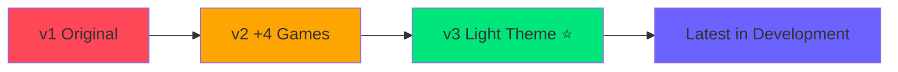

# 🐱 Meow Games — BY VANSH

<div align="center">


### 🎰 Premium Casino Games Web App
**Real Aviator-Style · Telegram Mini App · Live & Ready to Play**

[](https://vanshvx1-afk.github.io/telegram-games/v3)
[](https://t.me/MeowMiniGamebot)
[](https://vanshvx1-afk.github.io)

 


</div>

---

<div align="center">

## 🚀 Quick Links

| **🎮 [PLAY NOW](https://vanshvx1-afk.github.io/telegram-games/v3)** | **🤖 [TELEGRAM BOT](https://t.me/MeowMiniGamebot)** | **👨‍💻 [MY PORTFOLIO](https://vanshvx1-afk.github.io)** |
|:---:|:---:|:---:|
| Live web version | Play in Telegram | More projects |

</div>

---

<div align="center">

## 🎬 Live Preview Gallery

<table>
<tr>
<td width="33%">

<p align="center"><b>🏠 Home Screen</b><br/>Live chat · Daily missions · VIP progress</p>
</td>
<td width="33%">

<p align="center"><b>✈️ MeowFly (Aviator)</b><br/>Real-time multiplier · Live players · Auto cashout</p>
</td>
<td width="33%">

<p align="center"><b>💣 Mines</b><br/>24× max win · Smart cashout · Gem particles</p>
</td>
</tr>
<tr>
<td width="33%">

<p align="center"><b>🎲 Dice</b><br/>Roll under target · 9.9× multiplier · Instant results</p>
</td>
<td width="33%">

<p align="center"><b>🎡 Fortune Wheel</b><br/>CSS animations · 5× max · Daily free spin</p>
</td>
<td width="33%">

<p align="center"><b>🛡️ Admin Panel</b><br/>11 tabs · Full control · Live analytics</p>
</td>
</tr>
</table>

</div>

---

<div align="center">

## ✨ What Makes This Special?


</div>

| 🎨 Visual Effects | 🎮 Game Mechanics | 📱 Mobile First | 🔧 Admin Tools |
|:-:|:-:|:-:|:-:|
|  |  |  |  |
| **Fireworks** on big wins<br/>**Gem sparkle** bursts<br/>**Confetti** animations | **Martingale** strategy<br/>**Auto cashout**<br/>**Bet patterns** | **Swipe** navigation<br/>**Haptic** feedback<br/>**Offline** mode | **Force** win/lose<br/>**Live** stats<br/>**Player** control |

---

<div align="center">

## 🌐 Access Methods

</div>

<table>
<tr>
<td width="50%" align="center">

### 🌍 Web Version

**[vanshvx1-afk.github.io/telegram-games/v3](https://vanshvx1-afk.github.io/telegram-games/v3)**

✅ Works on any device  
✅ No installation needed  
✅ Full-screen mode available  
✅ Share with anyone  

<a href="https://vanshvx1-afk.github.io/telegram-games/v3">

</a>

</td>
<td width="50%" align="center">

### 💬 Telegram Bot

**[@MeowMiniGamebot](https://t.me/MeowMiniGamebot)**

✅ Integrated in Telegram  
✅ Instant access  
✅ Share with friends  
✅ Native app feel  

<a href="https://t.me/MeowMiniGamebot">

</a>

</td>
</tr>
</table>

---

<div align="center">

## 📁 Version History & Files


</div>



| Version | File | Features | Status | Live URL |
|:-------:|:----:|:---------|:------:|:---------|
| **v1** | `index.html (v1)` | 4 games, basic UI | 🟥 Deprecated | - |
| **v2** | `index.html (v2)` | +4 games, improved animations | 🟨 Backup | - |
| **v3** ⭐ | `index.html (v3)` | Light theme, PWA, Service Worker | 🟩 **LIVE** | **[Play v3](https://vanshvx1-afk.github.io/telegram-games/v3)** |
| **Latest** | `index.html` | All features, bug fixes, optimized | 🔵 Development | - |

<div align="center">

> 💡 **Use v3 for production** — fully tested & stable  
> 🚧 Latest version has experimental features

</div>

### 📦 Support Files Compatibility

```diff
┌────────────────────┬─────┬─────┬─────┬────────┐
│ File               │ v1  │ v2  │ v3  │ Latest │
├────────────────────┼─────┼─────┼─────┼────────┤
│ index.html         │  ✅  │  ✅  │  ✅  │   ✅   │
│ sw.js              │  ❌  │  ❌  │  ✅  │   ✅   │
│ manifest.json      │  ❌  │  ❌  │  ✅  │   ✅   │
└────────────────────┴─────┴─────┴─────┴────────┘
```

- **`sw.js`** — Service Worker for offline play (required from v3+)
- **`manifest.json`** — PWA config for "Add to Home Screen" (optional)

---

<div align="center">

## 🚀 Quick Deploy Guide

### GitHub Pages (2 Minutes Setup)


</div>

### Method 1: Fork This Repo (Easiest)

```bash
1. Click "Fork" button on GitHub
2. Go to Settings → Pages
3. Source: main branch / root
4. Save and wait 2 minutes
5. Your game is live at: https://your-username.github.io/telegram-games/v3
```

### Method 2: Fresh Repository

**1️⃣ Create new repo and upload files:**
```bash
git clone https://github.com/yourusername/your-game-name.git
cd your-game-name

# Download these files from the v3 folder:
- index.html
- sw.js
- manifest.json
- README.md

git add .
git commit -m "🎮 Deploy Meow Games"
git push origin main
```

**2️⃣ Enable GitHub Pages:**
<div align="center">

```
GitHub Repo → Settings → Pages
   ↓
Source: main branch / root
   ↓
💾 Save
```

</div>

**3️⃣ Your game is live at:**
```
🌐 https://yourusername.github.io/your-game-name
```

---

### 💻 Local Development

<table>
<tr>
<td width="50%">

**Method 1: Live Server**
```bash
cd your-game-folder
npx live-server
```
Opens at `http://localhost:8080`

✅ Auto-reload on file changes  
✅ Works with Service Worker  
✅ Easy debugging  

</td>
<td width="50%">

**Method 2: Direct Open**
```bash
# Just double-click
index.html
```
Opens directly in browser

✅ No installation needed  
✅ Works immediately  
⚠️ Service Worker may not work  

</td>
</tr>
</table>

---

<div align="center">

## 🎮 Complete Game Collection


</div>

<table>
<tr>
<th width="5%">#</th>
<th width="15%">Game</th>
<th width="10%">Max Win</th>
<th width="35%">Description</th>
<th width="35%">Preview</th>
</tr>

<tr>
<td align="center">1</td>
<td><b>💣 Mines</b></td>
<td align="center"><code>24×</code></td>
<td>Click tiles to find gems, avoid bombs. Cash out anytime to keep winnings. Risk vs reward strategy game with sparkle effects.</td>
<td></td>
</tr>

<tr>
<td align="center">2</td>
<td><b>🐱 MeowFly</b></td>
<td align="center"><code>∞×</code></td>
<td>Aviator-style crash game. Plane takes off, multiplier rises. Cash out before it crashes! Live players, auto-cashout, bet strategies.</td>
<td></td>
</tr>

<tr>
<td align="center">3</td>
<td><b>🎲 Dice</b></td>
<td align="center"><code>9.9×</code></td>
<td>Set target number (1-100), roll below to win. Lower target = higher multiplier. Simple, fast, addictive.</td>
<td></td>
</tr>

<tr>
<td align="center">4</td>
<td><b>🎡 Wheel</b></td>
<td align="center"><code>5×</code></td>
<td>Spin the fortune wheel with 8 segments. Smooth CSS rotation animation. Daily free spin with up to $200 bonus.</td>
<td></td>
</tr>

<tr>
<td align="center">5</td>
<td><b>⚽ Plinko</b></td>
<td align="center"><code>5×</code></td>
<td>Drop ball through pegs with realistic physics. 9 prize buckets with different multipliers. Watch the ball bounce!</td>
<td></td>
</tr>

<tr>
<td align="center">6</td>
<td><b>🃏 Hi-Lo</b></td>
<td align="center"><code>12×</code></td>
<td>Guess if next card is higher or lower. Chain correct guesses for exponential multiplier. Animated card deck.</td>
<td></td>
</tr>

<tr>
<td align="center">7</td>
<td><b>🎱 Keno</b></td>
<td align="center"><code>40×</code></td>
<td>Pick 1-10 numbers from 40. Match as many as possible. Quick-select patterns: Cross, Corners, Diagonal, Lucky 7s.</td>
<td></td>
</tr>

<tr>
<td align="center">8</td>
<td><b>🎰 Double Up</b></td>
<td align="center"><code>4×</code></td>
<td>Predict Red/Black or exact suit. Streak multiplier system. Fast-paced card prediction with visual effects.</td>
<td></td>
</tr>

</table>

<div align="center">

> 🚧 **Coming Soon:** Slots, Blackjack, Poker, Rocket League, Sports Betting

</div>

---

<div align="center">

## ✏️ Easy Customization


</div>

### 🔐 Change Admin Password

```javascript
// Open index.html, search for: CFG.admin
admin: { 
  pwd: 'vansh'   // ← Change to your password
}
```

---

### 🔊 Replace Sound Effects

<details>
<summary><b>🎵 Click to view all sound locations</b></summary>

```javascript
// Search for: CFG.snd in index.html

mines: {
  safe:  'https://your-cdn.com/gem.mp3',        // Gem found ✨
  bomb:  'https://your-cdn.com/explosion.mp3',   // Mine hit 💥
  win:   'https://your-cdn.com/cashout.mp3',     // Cashout 💰
  funny: 'https://your-cdn.com/meow.mp3',        // Rare (7%) 🐱
  start: 'https://your-cdn.com/start.mp3',       // Game start
},

meowfly: {
  fly:     'https://your-cdn.com/takeoff.mp3',   // Plane takes off ✈️
  boom:    'https://your-cdn.com/crash.mp3',     // Crash 💥
  cashout: 'https://your-cdn.com/cashout.mp3',   // Cashout success
  loss:    'https://your-cdn.com/lose.mp3',      // Loss after crash
},

dice:  { roll, win, lose },
wheel: { spin, win, lose },
plinko:{ drop, bigwin, lose },
hilo:  { deal, win, lose, cash },
keno:  { pick, draw, hit, bigwin, lose }
```

> 💡 **Tip:** Use direct `.mp3` or `.wav` links from any CDN

</details>

---

### 🎨 Color Themes

<div align="center">

<table>
<tr>
<td width="50%">

**🌙 Dark Theme**
```css
/* Search for: :root { */
:root {
  --pri:  #6c63ff;  /* Purple - buttons */
  --suc:  #00e67a;  /* Green - wins */
  --dan:  #ff4757;  /* Red - losses */
  --warn: #ffa502;  /* Orange - warnings */
  --gold: #ffd700;  /* Gold - VIP */
  --bg:   #080c18;  /* Dark background */
}
```

</td>
<td width="50%">

**☀️ Light Theme**
```css
/* Search for: [data-theme="light"] */
[data-theme="light"] {
  --pri:  #5147e8;  /* Blue */
  --suc:  #00c853;  /* Green */
  --dan:  #d32f2f;  /* Red */
  --warn: #ff6f00;  /* Orange */
  --bg:   #f0f2ff;  /* Light BG */
}
```

</td>
</tr>
</table>

**Color Preview:**

    

</div>

---

### ⚙️ Game Settings

<table>
<tr>
<th width="30%">Setting</th>
<th width="40%">Search For</th>
<th width="30%">Default</th>
</tr>

<tr>
<td><b>🎰 House Edge</b></td>
<td><code>edge: 3</code></td>
<td>3% (range: 0-50)</td>
</tr>

<tr>
<td><b>💰 Starting Balance</b></td>
<td><code>def: { bal: 1000 }</code></td>
<td>$1000</td>
</tr>

<tr>
<td><b>🎁 Daily Bonus Range</b></td>
<td><code>bonus: { min: 10, max: 500 }</code></td>
<td>$10 - $500</td>
</tr>

<tr>
<td><b>⏰ Bonus Cooldown</b></td>
<td><code>bonus: { cd: 864e5 }</code></td>
<td>24 hours</td>
</tr>

<tr>
<td><b>📱 Telegram Bot Token</b></td>
<td><code>tg: { token: '' }</code></td>
<td>From @BotFather</td>
</tr>

<tr>
<td><b>🖼️ Logo/Icon</b></td>
<td><code>i.ibb.co/JFqyY0BN/logo.png</code></td>
<td>Replace URL</td>
</tr>

</table>

---

<div align="center">

## 🛡️ Admin Panel Features


### How to Access

</div>

| Method | Action |
|:------:|:-------|
| **Desktop** | Press `Shift + A` |
| **Mobile** | Tap logo **5 times quickly** |
| **Password** | Default: `vansh` |

---

### 11 Admin Tabs Overview

<table>
<tr>
<td width="50%">

**📊 Stats**
- Session overview
- Win/loss ratio
- Total wagered
- House profit/loss
- Player information

**🎛️ Control**
- Force next game result
- Force N wins/losses
- Alternate pattern
- Add $100 to $1M
- Quick scenarios

**💣 Mines**
- View live mine map
- Reveal safe tiles
- Trigger specific bombs
- Force cashout
- Refund bet

**🎮 Games**
- Monitor MeowFly live
- Force crash point
- HiLo card control
- Wheel segment forcing

**🎰 Rig**
- Set dice result (1-100)
- Set crash multiplier
- Force wheel/plinko outcome
- Keno number control

**👥 Players**
- View player profiles
- Edit VIP levels
- Adjust loyalty points
- Manage fake players

</td>
<td width="50%">

**📈 Analytics**
- Win/loss bar charts
- Per-game P&L tables
- Games per hour
- Export to JSON
- Export to CSV

**🔔 Alerts**
- Toggle 7 notification types
- Balance thresholds
- Streak alerts
- Crash point alerts
- Custom triggers

**📨 Telegram**
- 10+ quick send buttons
- 5 message templates
- Broadcast to players
- Send stats reports
- Error notifications

**📜 Logs**
- Full activity history
- Win/loss filtering
- Export as .txt
- Send to Telegram
- Clear history

**⚙️ Config**
- House edge adjustment
- Bonus controls
- Reset cooldowns
- System diagnostics
- Performance metrics

</td>
</tr>
</table>

---

### 🎬 Admin Scenarios (One-Click)

```
🎆 Big Win Streak    → Trigger 5 consecutive wins with increasing multipliers
😭 Bad Luck          → Force 3 losses in a row to simulate variance
💪 Recovery Story    → Loss → Loss → Big Win (3× recovery)
🚀 High Roller Mode  → Enable big bet limits and high multipliers
📉 Down to $10       → Simulate near-bankruptcy for testing
```

---

<div align="center">

## ⌨️ Keyboard Shortcuts


</div>

<table>
<tr>
<td width="50%">

### 🎮 Navigation
| Key | Action |
|:---:|:-------|
| `1` | 🏠 Home |
| `2` | 💣 Mines |
| `3` | 🐱 MeowFly |
| `4` | 🎲 Dice |
| `5` | 🎡 Wheel |
| `6` | ⚽ Plinko |
| `7` | 🃏 Hi-Lo |
| `8` | 🎱 Keno |
| `9` | 📊 Dashboard |
| `0` | 🏆 Leaderboard |

</td>
<td width="50%">

### ⚡ Quick Actions
| Key | Action |
|:---:|:-------|
| `H` | 📜 History |
| `S` | ⚙️ Settings |
| `Space` | 💰 Cash Out |
| `Esc` | ❌ Close Popup |
| `?` | ❓ Help |
| `Shift+A` | 🛡️ Admin Panel |
| `Ctrl+R` | 🔄 Reset Game |
| `Ctrl+T` | 🌙 Toggle Theme |

</td>
</tr>
</table>

---

<div align="center">

## 📱 Mobile Features


</div>

| Feature | Description |
|:-------:|:------------|
| 👆 **Swipe Navigation** | Swipe left/right between screens |
| 📲 **Install to Home** | Add to home screen like native app (PWA) |
| 📴 **Offline Mode** | Play without internet after first load |
| 📳 **Haptic Feedback** | Vibration on taps, wins, explosions |
| 🌙 **Theme Toggle** | Quick dark/light switch in header |
| 🔊 **Sound Control** | Mute/unmute with one tap |
| 📊 **Responsive UI** | Perfect on all screen sizes |
| ⚡ **Fast Loading** | Service Worker caching |

### 📲 Install as App (PWA)

<table>
<tr>
<td width="33%" align="center">

**iOS (Safari)**
1. Tap Share button
2. "Add to Home Screen"
3. Tap "Add"
4. ✅ App icon on home screen

</td>
<td width="33%" align="center">

**Android (Chrome)**
1. Tap menu (⋮)
2. "Install app"
3. Tap "Install"
4. ✅ App in app drawer

</td>
<td width="33%" align="center">

**Desktop (Chrome/Edge)**
1. Click ⊕ in address bar
2. "Install Meow Games"
3. Click "Install"
4. ✅ Desktop app

</td>
</tr>
</table>

---

<div align="center">

## 🌟 Premium Features Included


</div>

<table>
<tr>
<th width="25%">Category</th>
<th width="75%">What's Included</th>
</tr>

<tr>
<td><b>⭐ VIP System</b></td>
<td>
6 Levels: 🥉 Bronze → 🥈 Silver → 🥇 Gold → 💎 Platinum → 💍 Diamond → 👑 Legend<br/>
Progressive perks, better bonuses, exclusive access
</td>
</tr>

<tr>
<td><b>🎯 Daily Missions</b></td>
<td>
7 missions with $15-$75 rewards:<br/>
Win 5 games • Wager $500 • Hit 10× • Play 3 games • 3 cashouts • 3-win streak • Complete all
</td>
</tr>

<tr>
<td><b>🏅 Achievements</b></td>
<td>
10 badges with confetti animations:<br/>
First Win • Big Winner • Hot Streak • Comeback King • Perfect Play • High Roller • Champion • VIP • Profit Master • Legend
</td>
</tr>

<tr>
<td><b>🎡 Daily Spin</b></td>
<td>
Free wheel spin every 24h with 8 prizes:<br/>
$10 • $25 • $50 • $75 • $100 • $150 • $200 • Mystery Box
</td>
</tr>

<tr>
<td><b>💬 Live Chat</b></td>
<td>
50+ fake players chatting:<br/>
Win announcements • Reactions • Strategy tips • Auto-scroll • Emoji support
</td>
</tr>

<tr>
<td><b>🏆 Leaderboard</b></td>
<td>
Top 10 in 4 categories:<br/>
💰 Profit • 🎮 Wins • 🔥 Streak • 💸 Wagered<br/>
Real-time updates • Medals • Player cards
</td>
</tr>

<tr>
<td><b>🔥 Win Streaks</b></td>
<td>
Live counter with fire animation:<br/>
Tracks wins across all games • Saves to storage • Banner popup • Resets on loss
</td>
</tr>

<tr>
<td><b>♟️ Bet Strategies</b></td>
<td>
Auto-bet systems for MeowFly:<br/>
Martingale (double on loss) • Fibonacci (1,1,2,3,5...) • D'Alembert (+1/-1)
</td>
</tr>

<tr>
<td><b>🤖 Auto-Play</b></td>
<td>
Mines automation:<br/>
Set round count (1-100) • Auto cashout • Win/loss limits • Pause/resume
</td>
</tr>

<tr>
<td><b>🎱 Quick Patterns</b></td>
<td>
Keno one-click selections:<br/>
✖️ Corners • ➗ Diagonal • ✚ Cross • ⬆️ Top Row • 🍀 Lucky 7s • 🎯 Center
</td>
</tr>

<tr>
<td><b>📊 Analytics</b></td>
<td>
Deep statistics:<br/>
Avg win/loss • Expected value • Risk:reward • Win rate % • Export CSV/JSON
</td>
</tr>

<tr>
<td><b>💹 Crash Stats</b></td>
<td>
MeowFly insights:<br/>
Last 100 crashes chart • Avg/min/max • Probability calc • Sparkline history
</td>
</tr>

<tr>
<td><b>🎆 Visual FX</b></td>
<td>
Eye-candy animations:<br/>
Fireworks on $100+ wins • Gem particles • Card flips • Plane crash flash • Achievement confetti
</td>
</tr>

<tr>
<td><b>🛡️ Bankroll Mode</b></td>
<td>
Smart betting limits:<br/>
Auto-limit to 1-20% of balance • Prevents big losses • Visual warnings • Toggle on/off
</td>
</tr>

<tr>
<td><b>📤 Share Results</b></td>
<td>
Web Share API:<br/>
Generate win cards • Share to social • Copy link • Download PNG
</td>
</tr>

<tr>
<td><b>💾 Auto-Save</b></td>
<td>
Never lose progress:<br/>
Save every 500ms • LocalStorage backup • Import/export • No data loss
</td>
</tr>

<tr>
<td><b>🌐 Offline Play</b></td>
<td>
Service Worker caching:<br/>
Works without internet • Fast reload • Update notifications • Background sync
</td>
</tr>

</table>

---

<div align="center">

## 🐱 MeowFly — The Star Game


### Pixel-Perfect Aviator Recreation

</div>

<table>
<tr>
<td width="50%">

**✈️ Visual Design**
- Real SVG airplane model
- Animated engine flames
- Smooth takeoff animation
- Exponential curve on canvas
- Glow effects on multiplier
- Red flash on crash
- Particle trails

**⏱️ Game Mechanics**
- 2-second countdown timer
- "Waiting for bets" phase
- Live multiplier calculation
- Realistic crash algorithm
- Instant payout on cashout
- Loss detection system

</td>
<td width="50%">

**👥 Multiplayer Feel**
- 50+ fake player names
- Live bet feed scrolling
- Real-time cashouts shown
- Realistic bet amounts
- Player avatars
- Chat messages

**🎯 Advanced Features**
- Manual & Auto tabs
- Set auto-cashout target
- 3 bet strategies
- Round history with chart
- Crash statistics
- Milestone alerts (2×, 5×, 10×...)

</td>
</tr>
</table>

### 📸 MeowFly Screenshots

<table>
<tr>
<td width="33%">

<p align="center"><b>Waiting Phase</b><br/>2s before takeoff</p>
</td>
<td width="33%">

<p align="center"><b>In Flight</b><br/>Multiplier rising</p>
</td>
<td width="33%">

<p align="center"><b>Crashed</b><br/>Better luck next time!</p>
</td>
</tr>
</table>

---

<div align="center">

## 📂 File Structure

</div>

```
telegram-games/
│
├── v3/                     ← Current live version
│   ├── index.html          ← Complete game (15,000+ lines)
│   ├── sw.js               ← Service Worker (offline mode)
│   ├── manifest.json       ← PWA config (install prompt)
│   └── README.md           ← Documentation
│
├── v2/                     ← Backup version
│   └── index.html (v2)
│
├── v1/                     ← Original version
│   └── index.html (v1)
│
└── latest/                 ← Development version
    ├── index.html          ← Latest features (beta)
    ├── sw.js
    └── manifest.json
```

### Why Single HTML File?

✅ **No dependencies** — Pure vanilla JavaScript  
✅ **Works anywhere** — Just open in browser  
✅ **Easy to edit** — All code in one place (Ctrl+F)  
✅ **Fast loading** — No multiple HTTP requests  
✅ **Offline ready** — Service Worker caches one file  
✅ **GitHub Pages** — Upload and go, no build step  

---

<div align="center">

## 🐛 Troubleshooting


</div>

<details>
<summary><b>❌ JavaScript Error on Load</b></summary>

**Problem:** Console shows `Uncaught SyntaxError`

**Fix:**
1. Download fresh `index.html` from [v3 folder](https://vanshvx1-afk.github.io/telegram-games/v3)
2. Clear browser cache (`Ctrl+Shift+Delete`)
3. Hard reload (`Ctrl+F5`)

✅ Already fixed in v3

</details>

<details>
<summary><b>🔴 Service Worker Error</b></summary>

**Problem:** `sw.js` not found

**Fix:**
- Ensure `sw.js` is in same folder as `index.html`
- Check HTTPS (required for Service Worker)
- GitHub Pages automatically uses HTTPS ✅

</details>

<details>
<summary><b>🔇 No Sound Playing</b></summary>

**Problem:** Silent game

**Fix:**
1. **Tap screen once** — browsers block audio until user interaction
2. Check mute button in settings
3. Verify sound URLs work (test in new tab)
4. Enable autoplay in browser settings

</details>

<details>
<summary><b>🔐 Can't Open Admin Panel</b></summary>

**Problem:** Nothing happens

**Fix:**
- Desktop: Press `Shift + A`
- Mobile: Tap logo **5 times** within 2 seconds
- Default password: `vansh`

</details>

<details>
<summary><b>💾 Balance Resets on Refresh</b></summary>

**Problem:** Loses progress

**Fix:**
- Enable localStorage in browser
- Don't use private/incognito mode
- Export profile as backup (Settings → Export)

</details>

<details>
<summary><b>📱 PWA Install Not Showing</b></summary>

**Problem:** No install prompt

**Fix:**
- Only works on HTTPS (GitHub Pages = auto ✅)
- Chrome/Edge: Menu → "Install app"
- Safari iOS: Share → "Add to Home Screen"
- Firefox desktop: Not supported

</details>

---

<div align="center">

## 📞 Contact & Support


</div>

<table>
<tr>
<td width="50%" align="center">

### 👨‍💻 Developer

**Vansh**

[](https://t.me/itsikiarai)
[](https://vanshvx1-afk.github.io)

📧 Email: `contact@vanshdev.com`

</td>
<td width="50%" align="center">

### 🛠️ Tech Stack


**100% Vanilla** — Zero dependencies

</td>
</tr>
</table>

---

### 🐛 Report Issues

Found a bug? [Open an issue](https://github.com/vanshvx1-afk/telegram-games/issues) with:
- 📱 Device & browser
- 📝 Steps to reproduce
- 📸 Screenshot

---

### ✨ Feature Requests

Want something new?
- 💡 Describe the feature
- 🎯 Why it's useful
- 🎨 How it should work

---

<div align="center">

## 🌟 Show Your Support

If you like Meow Games:

[](https://github.com/vanshvx1-afk/telegram-games)
[](https://t.me/MeowMiniGamebot)
[](https://vanshvx1-afk.github.io/telegram-games/v3)

</div>

---

<div align="center">

## 📜 License

**MIT License** — Free to use, modify, and distribute

```
Copyright (c) 2024 Vansh

Permission granted to use, copy, modify, merge, publish, distribute.
Just keep the credit line in the code.

THE SOFTWARE IS PROVIDED "AS IS", WITHOUT WARRANTY.
```

### ⚠️ Disclaimer

> **Entertainment Only** — Uses fake virtual currency  
> No real money involved · Not a real casino  
> 18+ recommended · Play responsibly

</div>

---

<div align="center">

## 🎉 Credits

**Inspired by:** Stake.com, Aviator, Classic Casino Games  
**Built with:** Pure Vanilla JavaScript (zero dependencies)  
**Hosted on:** GitHub Pages (free forever)  

**Special thanks to:**
- Beta testers
- GitHub community  
- Everyone who played and gave feedback

</div>

---

<div align="center">


### ⭐ Don't forget to star the repo!

[](https://github.com/vanshvx1-afk/telegram-games)
[](https://github.com/vanshvx1-afk/telegram-games/fork)

---

**[🎮 Play Now](https://vanshvx1-afk.github.io/telegram-games/v3)** · **[🤖 Telegram Bot](https://t.me/MeowMiniGamebot)** · **[👨‍💻 Portfolio](https://vanshvx1-afk.github.io)** · **[↑ Back to Top](#-meow-games--by-vansh)**

</div>
